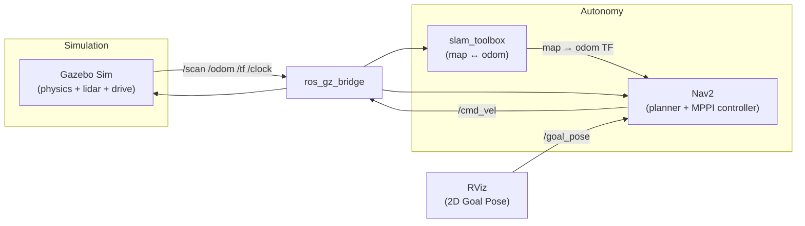

<div align="center">

# 🤖 Rocker-Bogie Rover

**A Mars-rover-style 6-wheel robot — designed in SolidWorks, simulated in ROS 2, mapping and navigating fully autonomously with lidar SLAM.**

[](https://docs.ros.org/en/jazzy/)
[](https://gazebosim.org/)
[](https://docs.nav2.org/)
[](https://github.com/SteveMacenski/slam_toolbox)
[](LICENSE)


*The rover exploring the generated Mars world in Gazebo Sim*

</div>

---

## ✨ What is this?

A complete, working simulation stack for a **6-wheel rocker-bogie rover** (the suspension architecture used by NASA's Mars rovers). The robot was designed in SolidWorks, modeled as a parameterized URDF, and driven through the full autonomy pipeline:

**Design → Physics simulation → Lidar SLAM → Click-a-goal autonomous navigation.**

Click a point in RViz and the rover plans a path around obstacles, drives itself there, and maps the world as it goes.

## 📸 Gallery

| SolidWorks Design | URDF Model (RViz) |
|:---:|:---:|
|  |  |
| **SLAM Map** *(10×10 m test room, 4 obstacles)* | **Autonomous Navigation** *(Mars world, live costmaps)* |
|  |  |

## 🚀 Features

- **Faithful rocker-bogie model** — passive rocker/bogie suspension joints, differential with tie rods, articulated in RViz; parameterized xacro (every dimension is a named property)
- **Physics simulation** in Gazebo Sim (Harmonic) with a 6-wheel skid-steer drive and a 360° / 12 m lidar
- **Calibrated odometry** — skid-steer yaw error was measured against simulator ground truth and compensated (×1.39 effective wheel separation), giving drift-free enough odometry for clean maps
- **Online SLAM** with slam_toolbox — drive around (teleop or autonomously) and watch the map build live
- **Autonomous navigation** with Nav2 (MPPI controller) — set goals in RViz or via action calls; obstacle avoidance, path planning, and recovery behaviors included
- **Two simulation worlds** — a clean walled test room, and a procedurally generated **Mars world**: boulder fields, a crater with a single entrance, a narrow canyon passage, ramps, and a rocky perimeter ridge (97 models, reproducible from a seeded generator script)
- **Two localization modes** — map-while-navigating (SLAM), or AMCL localization on a previously saved map

## 🏗️ Architecture



| Package | Purpose |
|---|---|
| `rover_description` | URDF/xacro model, RViz visualization, display launch |
| `rover_gazebo` | Gazebo worlds, spawn + bridge launch, Mars world generator |
| `rover_navigation` | SLAM config, Nav2 config, navigation launch, saved maps |

## ⚡ Quick Start

**Prerequisites:** Ubuntu 24.04 · ROS 2 Jazzy · Gazebo Sim (Harmonic, via `ros-jazzy-ros-gz`) · `ros-jazzy-slam-toolbox` · `ros-jazzy-nav2-bringup` · `ros-jazzy-teleop-twist-keyboard`

```bash
# clone & build
git clone https://github.com/KaveeshwaraBandara/rocker-bogie-rover.git
cd rocker-bogie-rover/rover_ws
colcon build --symlink-install
source install/setup.bash            # (or setup.zsh)
```

### Run it

| What | Command |
|---|---|
| 🔍 View the model + play with suspension | `ros2 launch rover_description display.launch.py` |
| 🎮 Simulate + drive with keyboard | `ros2 launch rover_gazebo sim.launch.py` + `ros2 run teleop_twist_keyboard teleop_twist_keyboard` |
| 🗺️ Build a map while driving | `ros2 launch rover_gazebo sim.launch.py rviz:=false` + `ros2 launch rover_navigation slam.launch.py` |
| 🤖 **Full autonomy** (SLAM + Nav2) | `ros2 launch rover_gazebo sim.launch.py rviz:=false` + `ros2 launch rover_navigation nav.launch.py` |
| 🔴 Autonomy on **Mars** | add `world:=mars_world.sdf` to the sim launch |
| ⛰️ **Suspension demo** — drive the rough-terrain test lane and watch the rocker-bogie articulate | `ros2 launch rover_gazebo sim.launch.py world:=mars_rough_world.sdf` + teleop, drive along **+X** |

Then in RViz: click **2D Goal Pose**, click anywhere on the map — the rover does the rest.

Send goals programmatically:

```bash
ros2 action send_goal /navigate_to_pose nav2_msgs/action/NavigateToPose \
  "{pose: {header: {frame_id: map}, pose: {position: {x: 3.0, y: -3.0}, orientation: {w: 1.0}}}}"
```

Save a finished map:

```bash
ros2 run nav2_map_server map_saver_cli -f my_map --ros-args -p use_sim_time:=true
```

Navigate on a saved map instead of live SLAM (AMCL):

```bash
ros2 launch rover_navigation nav.launch.py slam:=false
# then set the initial pose in RViz with "2D Pose Estimate"
```

## 🌍 Worlds

| `obstacle_world.sdf` *(default)* | `mars_world.sdf` | `mars_rough_world.sdf` |
|:---:|:---:|:---:|
| 10×10 m walled room, 4 obstacles — ideal for first mapping runs | 22×22 m Mars terrain — 34 boulders, crater, canyon, ramps, rocky ridge | 20×20 m rough-terrain suspension test lane — bump bars, staggered bars, log climbs, pebble field |

The Mars world is generated by [`rover_gazebo/scripts/gen_mars_world.py`](rover_ws/src/rover_gazebo/scripts/gen_mars_world.py) — tweak the rock density, crater position, or canyon width in the script, rerun it, rebuild, and you have a new (reproducible) planet. All obstacles are sized so the 2D lidar can see them, and rocks are placed with a guaranteed minimum gap so every region stays reachable.

## 🔧 Technical Notes

- **Suspension in simulation** — the rocker-bogie differential is a closed kinematic loop, which URDF cannot express directly. In the SLAM/navigation worlds the suspension is rigidified (no effect on flat-to-moderate terrain). In `mars_rough_world.sdf` the suspension is **fully live**: the rocker/bogie joints are passive revolutes and the differential bar is emulated with a URDF `<mimic>` constraint (right rocker = −left rocker) enforced by the bullet-featherstone physics engine — driving the rough lane, the chassis stays within ~7° of level while the bogies swing through ±20°, and climbing a 4 cm log lifts the chassis only ~1.5 cm. Wheel torque is capped like a real gearmotor (0.65 N·m stall), so the rover rock-crawls instead of wheelie-flipping.
- **Skid-steer odometry calibration** — with six fixed wheels, in-place turns skid; raw wheel odometry over-reported rotation by ×1.39 (measured against Gazebo ground-truth pose). The drive plugin's effective wheel separation is calibrated accordingly — this single fix took the SLAM maps from unusable (rotated ghost rooms) to clean single-pass maps.
- **Frames** follow REP-105: `map → odom → base_footprint → base_link → …`, lidar on `laser_frame`.

## 🗺️ Roadmap

- [x] URDF rocker-bogie model + RViz visualization
- [x] Gazebo simulation: skid-steer drive + lidar
- [x] SLAM mapping (slam_toolbox)
- [x] Nav2 autonomous navigation (SLAM + AMCL modes)
- [x] Mars demo world
- [ ] Waypoint-following missions
- [ ] Uneven-terrain worlds exercising the suspension
- [ ] Hardware build — this stack transfers to the real rover

## 🙏 Acknowledgments

- Rocker-bogie mechanism design tutorial: [Part 1 — parts design](https://youtu.be/X_NhGME49gQ) · [Part 2 — assembly & motion study](https://youtu.be/gKz1P_ilWDg)
- Built on [ROS 2](https://ros.org), [Gazebo Sim](https://gazebosim.org), [Nav2](https://docs.nav2.org), and [slam_toolbox](https://github.com/SteveMacenski/slam_toolbox)

## 📄 License

[MIT](LICENSE) © Kaveeshwara Bandara
